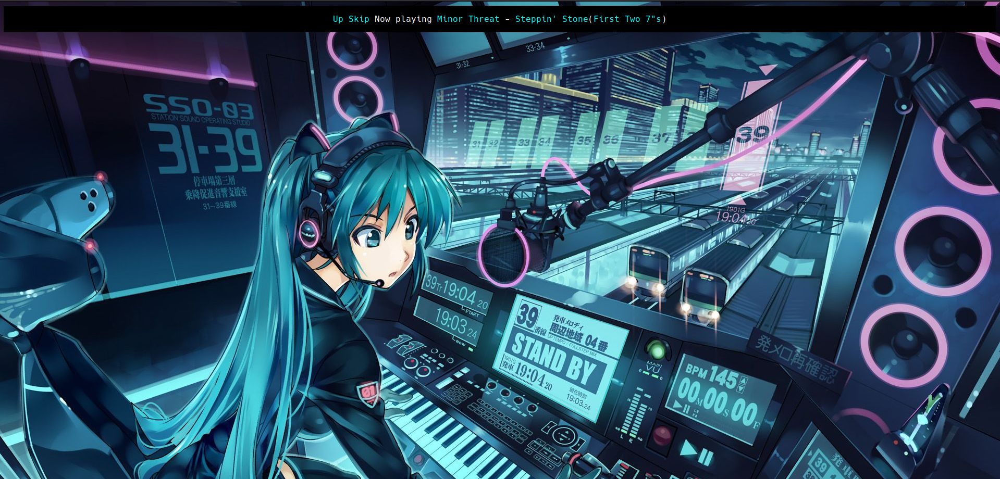
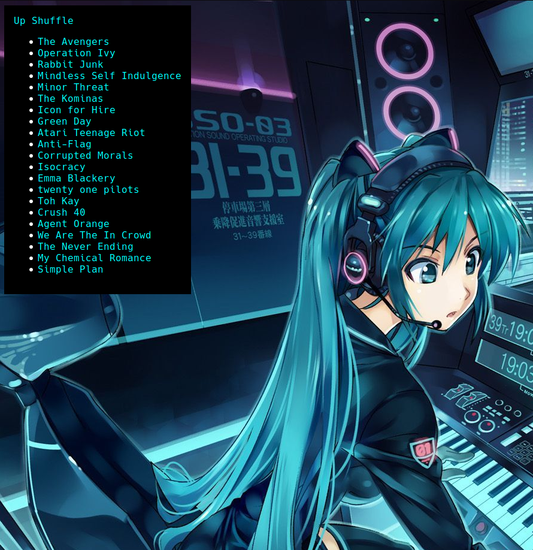

# WeebPlayer
If you haven't realised already I hate Javascript, I also like having access to my music library anywhere. So I wrote a web server with Sinatra that takes your music folder and turns it into a streaming service with a shuffle button. It has no persistent database because I don't need playlists and why overcomplicate things?  
To start it do `bundle install`, make sure you have `ffmpeg` installed and run `./main.rb`

Warning: This product contains anime  

